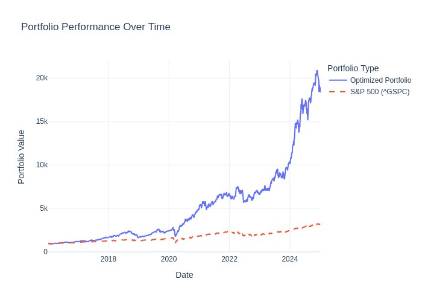

## Real-World Usage of Portfolio Optimization

To showcase the **capabilities** of the Portfolio Optimization Bot, here is an example scenario demonstrating the usage of the bot.

---

Let's assume we have initiated a chat with the portfolio optimizer. We want to begin with backtesting, so we first check the current settings using `/show_params`. We notice that **$1000** in capital matches our needs, but the timeframe is too short. Therefore, we use the `/set_param` method to update the **Investment Day** and set it to *2016-01-01*. Next, we run `/backtest`. Once the calculation is submitted, we *cannot* interrupt the bot and must wait for our results. At that point, the chat returns various metrics and a returns-over-time graph. For example, in my simulation on *January 10, 2025*, I obtained the following:

Optimized results:
- **Final Portfolio Value**: $18,366.98
- **Total Return**: 1,763.70%
- **Sortino Ratio**: 1.909
- **Max Drawdown**: 38.23%
- **VaR(95)**: -2.40%

Baseline (SP500):
- **Final Portfolio Value**: $3,150.10
- **Total Return**: 215.01%
- **Sortino Ratio**: 0.975
- **Max Drawdown**: 33.92%
- **VaR(95)**: -1.70%

Beyond these metrics, the **latest End of Day (EoD) portfolio holdings** are displayed, along with the last reshuffle date and the capital distribution weights for each ticker. Below is the *return plot*:

If we are satisfied with the performance, we can move forward by using the `/invest_today` method. The bot then calculates how our capital should be allocated to each ticker for immediate investment. We are also asked if we want to set up a reminder to reshuffle our portfolio, helping us stay on top of rebalancing to ensure our strategy remains aligned with our goals!

### Advanced mode

If we use the `/toggle_advanced` mode, additional parameters become available, such as:

- **Optimization Metric**: Predefined metrics the model should optimize for, e.g. *Sortino Ratio* or *Minimize Volatility*.  
- **Portfolio Optimization Interval**: How frequently the model redistributes the capital.  
- **Optimization History**: Which timeframe of historical ticker data should be used for optimization.  
- **Top N Stocks**: How many of the best-performing S&P 500 stocks should be considered.  
- **Ticker Update Interval**: How often we update and reconsider our ticker base for optimization.  
- **Transaction Cost Rate**: Relative transaction costs applied during capital reallocation.  
